# آزمایش شماره ۳ - مشاهده رفتار هسته و سیستم‌عامل

## مشاهده فایل سیستم `proc/`

ابتدا با استفاده از دستور 
`cd /proc`
به دایرکتوری 
`proc/`
می‌رویم.
سپس دستور 
`ls`
را می‌زنیم و لیست فایل‌ها و پوشه‌های موجود در این دایرکتوری را مشاهده می‌کنیم:

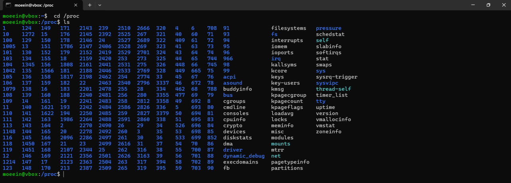

## مشاهده محتویات یک فایل در شاخه `proc/`


```
cat version
cat loadavg
cat partitions
cat uptime
```
با زدن دستورهای فوق می‌توان اطلاعات زیر را مشاهده کرد:

- این فایل اطلاعات ورژنینگ مربوط به سیستم‌عامل را نشان می‌دهد.
- فایل `loadavg` میانگین بار سیستم را نشان می‌دهد.
- فایل `partitions` هم ساختار پارتیشن‌بندی سیستم را نشان می‌دهد.
- فایل `uptime` مدت زمان بالا آمدن سیستم را نشان می‌دهد. عدد دوم هم نشان دهنده مدت زمان idle بودن پردازنده است.

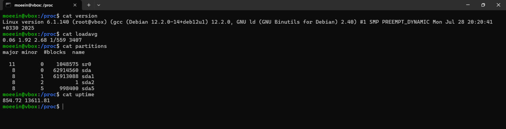

حال داخل فایل write.cpp یک کد با زبان cpp پیاده‌سازی می‌کنیم که با هر اجرا، محتویات فایل `proc/version/` را داخل یک فایل به نام `LinuxVersion.txt` در دایرکتوری فعلی می‌نویسد.

```cpp
#include <iostream>
#include <fstream>
#include <string>

int main() {
    std::fstream read_file("/proc/version", std::ios::in);
    if (!read_file.is_open()) {
        std::perror("error in opening /proc/version");
        return 1;
    }

    std::fstream write_file("LinuxVersion.txt", std::ios::out | std::ios::app);
    if (!write_file.is_open()) {
        std::perror("error in opening LinuxVersion.txt");
        return 1;
    }

    std::string line;
    while (std::getline(read_file, line)) {
        write_file << line << '\n';
    }

    read_file.close();
    write_file.close();

    return 0;
}
```

تلاش می‌کنیم تا داخل فایل `proc/version/` متنی را بنویسیم. می‌بینیم که حتی با دسترسی `root`
هم نمی‌توان داخل این فایل چیزی نوشت.

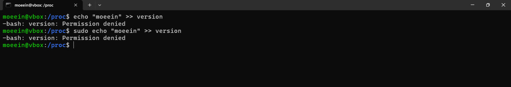

## مشاهده‌ی وضعیت پردازه‌ها

وارد پوشه مربوط به یکی از پردازه‌ها می‌شویم و لیست فایل‌ها و پوشه‌های آن را در ادامه مشاهده می‌کنیم:

```bash
su
cd /proc
cd 1
ls
```
البته برای مشاهده لینک‌های مربوط به 
`cwd` و 
`root` و 
`exe`
نیازمند دسترسی root هستیم.

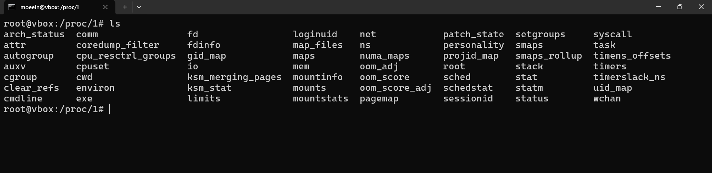

مشاهده اطلاعات مربوط به تعدادی از فایل‌ها:

- **environ**: این فایل حاوی متغیرهای محیطی پردازه مورد نظر است.

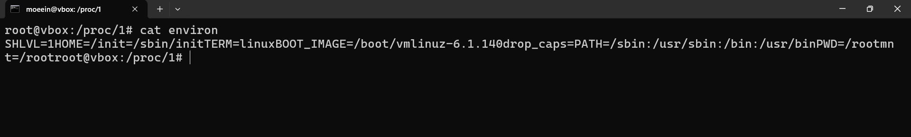

- **stat**: این فایل اطلاعات و وضعیت پردازه مورد نظر را نشان می‌دهد.

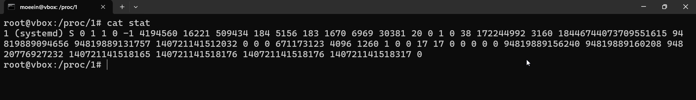

- **statm**: این فایل حاوی اطلاعات و وضعیت حافظه‌ی مرتبط با پردازه‌ی مورد نظر است.

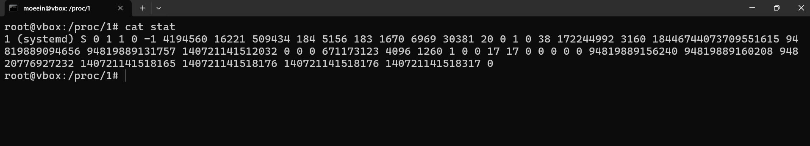

- **status**: این فایل اطلاعات دو فایل گذشته را به صورت human readable نشان می‌دهد.

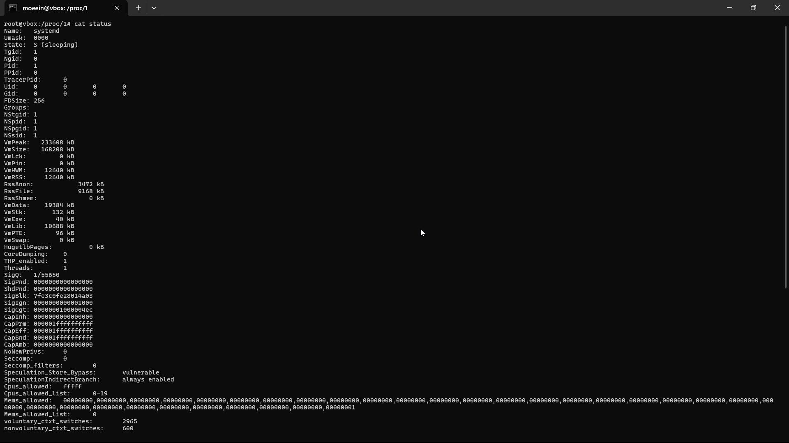

- **cwd** (current work directory): این یک لینک به دایرکتوری اجرای پردازه مورد نظر است.

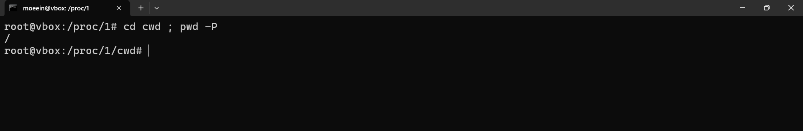

- **cmdline**: دستور کاملی که فرایند با آن اجرا شده را نشان می‌دهد.

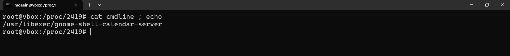

- **exe**: این یک لینک به فایل اجرایی اصلی فرایند است.

با استفاده از دستور زیر می‌توان دید که فایل اجرایی از کجا اجرا شده است:
‍‍‍
```bash
readlink exe
```

- **root**: این یک لینک به ریشه‌ی فایل‌سیستم که فرایند به آن دسترسی دارد است.

<br/>
<br/>

حال یک اسکریپت می‌نویسیم که لیست شماره پردازه‌ها به همراه نام آن‌ها را چاپ کند:

```bash
echo -e "PID\tCOMMAND"
echo "-------------------------"

for pid in /proc/[0-9]*; do
    pid_num=$(basename "$pid")
    if [[ -r "$pid/comm" ]]; then
        cmd=$(cat "$pid/comm")
        echo -e "$pid_num\t$cmd"
    fi
done
```

سپس به آن دسترسی اجرا می‌دهیم و آن را اجرا می‌کنیم:

```bash
chmod +x proc_list.sh
./proc_list
```

### تمرین ۱

ابتدا یک اسکریپت بش می‌نویسیم که اطلاعات مربوط به پردازه داده شده را چاپ کند:

```bash
if [ $# -ne 1 ]; then
    echo "Usage: $0 <PID>"
    exit 1
fi

pid="$1"
proc_dir="/proc/$pid"

if [ ! -d "$proc_dir" ]; then
    echo "Process with PID $pid does not exist."
    exit 1
fi

echo "Process Name:"
cat "$proc_dir/comm" 2>/dev/null

echo "Executable Path:"
readlink "$proc_dir/exe" 2>/dev/null

echo "Memory Usage:"
if [ -r "$proc_dir/statm" ]; then
    rss_pages=$(awk '{print $2}' "$proc_dir/statm")
    page_size=$(getconf PAGESIZE)
    memory_bytes=$((rss_pages * page_size))
    echo "$memory_bytes"
else
    echo "Unavailable"
fi

echo "Command Line Arguments:"
tr '\0' ' ' < "$proc_dir/cmdline" 2>/dev/null
echo

echo "Environment Variables:"
tr '\0' '\n' < "$proc_dir/environ" 2>/dev/null
```

سپس دسترسی اجرا به آن می‌دهیم و شماره پردازه را در آرگومان اول به آن می‌دهیم:

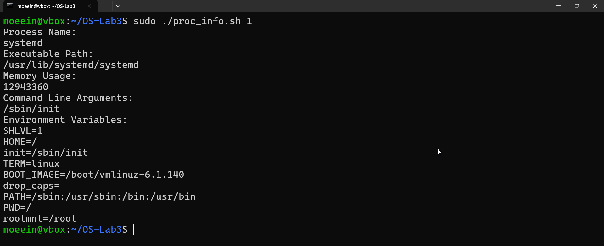

بعضی از اطلاعات نیازمند دسترسی sudo هستند!

## مشاهده اطلاعات مربوط به هسته

مجددا وارد پوشه 
`proc/`
می‌شویم و دستور 
`ls`
را اجرا می‌کنیم:

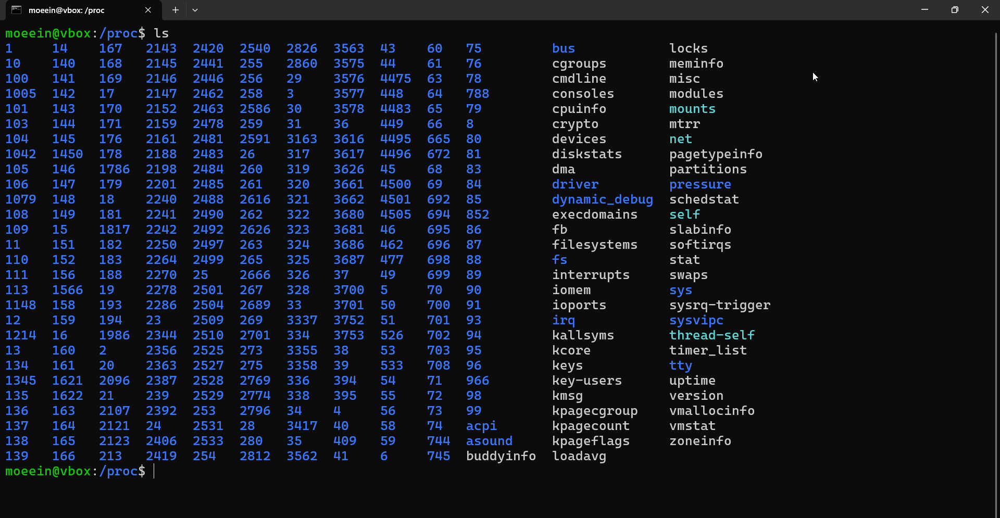

سپس فایل‌های زیر را بررسی می‌کنیم:

- **cmdline**: در قسمت قبل بررسی شد.
- **stat**: در قسمت قبل بررسی شد.
- **uptime**: در قسمت قبل بررسی شد.
- **version**: در قسمت قبل بررسی شد.
- **cpuinfo**: در این فایل اطلاعات مربوط به هر cpu core نوشته شده است:

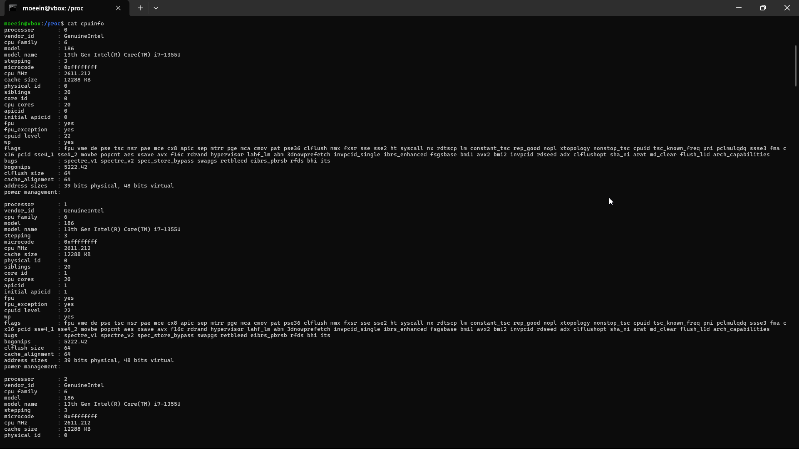

- **filesystems**: در این فایل لیست تمامی فایل سیستم‌هایی که کرنل از آن‌ها پشتیبانی می‌کند وجود دارد:

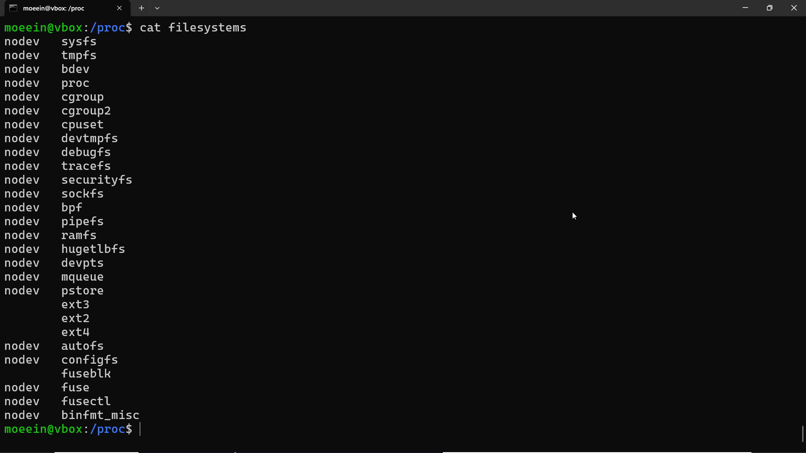

- **ioports**: در این فایل لیست پورت‌های مربوط به I/O سیستم وجود دارد:

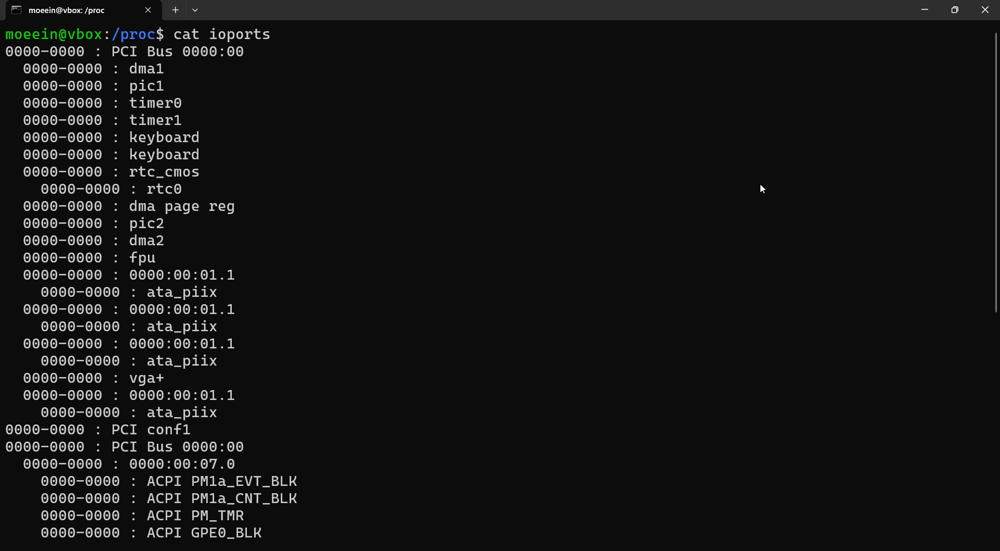

- **interrupts**: لیست وقفه‌هایی که هر یک از دستگاه‌های IO روی پردازنده‌هااعمال کرده است.

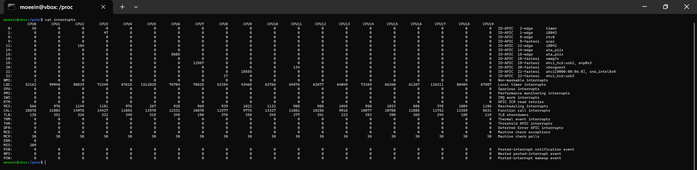


- **loadavg**: این فایل اطلاعاتی درباره‌ی وضعیت بار سیستم ارائه می‌دهد. سه عدد اول این فایل، میانگین تعداد فرایندهای آماده‌ی اجرا را در بازه‌های زمانی ۱، ۵ و ۱۵ دقیقه‌ی گذشته نشان می‌دهند. این اعداد نشان می‌دهند که در طول این بازه‌ها، به‌طور متوسط چند فرایند در انتظار پردازش بوده‌اند. عدد چهارم، نسبت تعداد فرایندهای فعال به کل فرایندهای موجود در سیستم را نمایش می‌دهد، و عدد آخر، PID آخرین فرایند ایجادشده در سیستم است.

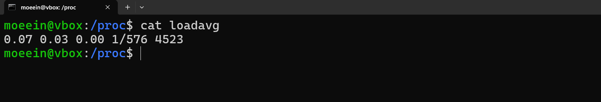

- **net**: این یک پوشه است که در آن تعدادی فایل در مورد وضعیت و تنظیمات شبکه سیستم وجود دارد.

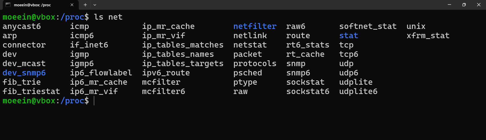

- **mounts**: در این فایل لیست mount های مربوط به namespace های پردازه فعلی وجود دارد.

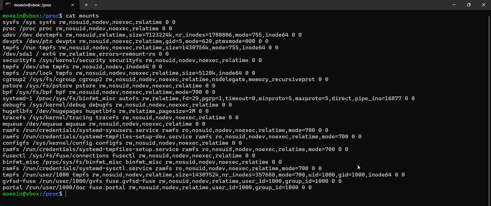

- **meminfo**: اطلاعات مربوط به مصرف حافطه‌ی کل سیستم در این فایل نشان داده می‌شود:

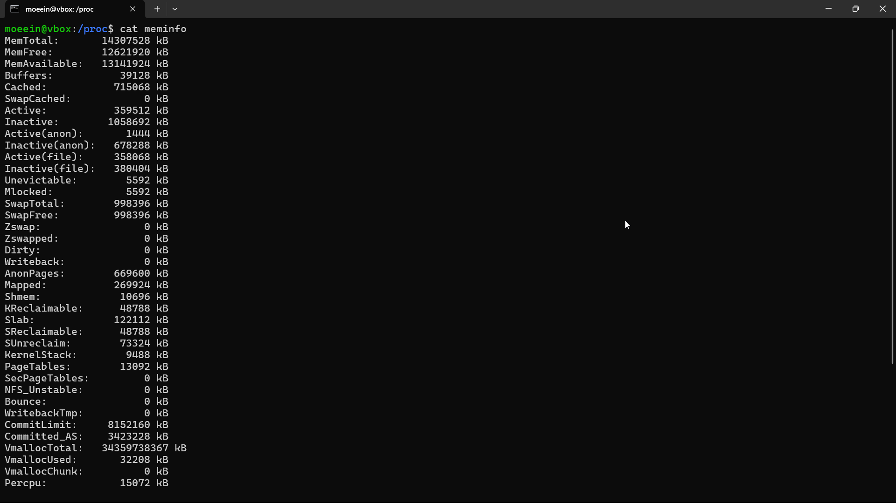


در ادامه اسکریپتی می‌نویسیم تا مدل پردازنده، فرکانس و حافظه نهان آن را چاپ کند:

```bash
model_name=$(grep -m1 "model name" /proc/cpuinfo)
cpu_cores=$(grep -m1 "cpu cores" /proc/cpuinfo)
cpu_mhz=$(grep -m1 "cpu MHz" /proc/cpuinfo)
cache_size=$(grep -m1 "cache size" /proc/cpuinfo)

echo "$model_name"
echo "$cpu_cores"
echo "$cpu_mhz"
echo "$cache_size"
```

در نهایت به فایل دسترسی اجرا می‌دهیم و آن را اجرا می‌کنیم:

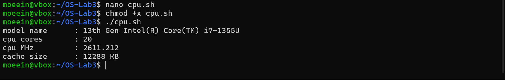


در ادامه یک اسکریپت دیگر می‌نویسیم که مقدار حافظه کل (total)، استفاده‌شده (used) و آزاد (free) را از فایل `proc/meminfo/` استخراج کرده و نمایش می‌دهد:

```bash
mem_total=$(grep MemTotal /proc/meminfo | awk '{print $2}')
mem_free=$(grep MemFree /proc/meminfo | awk '{print $2}')
buffers=$(grep Buffers /proc/meminfo | awk '{print $2}')
cached=$(grep ^Cached /proc/meminfo | awk '{print $2}')

mem_used=$((mem_total - mem_free - buffers - cached))

echo "Total Memory:  ${mem_total} kB"
echo "Used Memory:   ${mem_used} kB"
echo "Free Memory:   ${mem_free} kB"
```
در نهایت به فایل دسترسی اجرا می‌دهیم و آن را اجرا می‌کنیم:

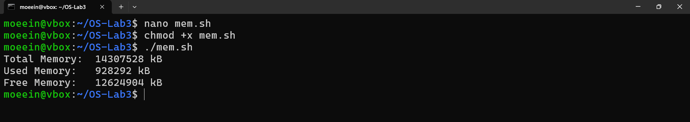


### تمرین ۲

#### بخش اول

وارد پوشه 
`proc/sys/kernel/`
می‌شویم و تعدادی از فایل‌های موجود در آن را بررسی می‌کنیم:

- **hostname**: این فایل نام میزبان فعلی سیستم را نشان می‌دهد.
- **osrelease**: نسخه‌ی هسته‌ی لینوکس را نشان می‌دهد.
- **panic**:  مدت زمانی (بر حسب ثانیه) که سیستم پس از رخداد kernel panic صبر می‌کند تا ریبوت شود.
- **shmmax**:  حداکثر اندازه‌ی یک بخش حافظه‌ی اشتراکی (Shared Memory) که یک فرآیند می‌تواند ایجاد کند.
- **threads-max**:  حداکثر تعداد thread هایی که سیستم می‌تواند به طور هم‌زمان داشته باشد.

نتیجه:

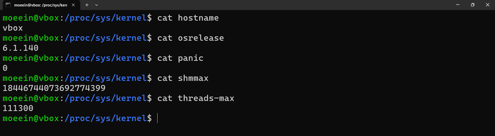

#### بخش دوم
 
مسیر 
`proc/self/`
یک لینک به دایرکتوری 
`proc/[PID]/`
پردازه‌ای است که در حال حاضر این دستور را اجرا کرده است.
به عنوان مثال دستور زیر را وارد می‌کنیم:
```bash
ls -l /proc/self
```
و با نتیجه زیر رو به رو می‌شویم که پردازه فعلی را نشان می‌دهد:

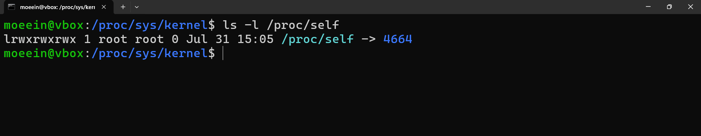

این قابلیت برای برنامه‌نویسان و اسکریپت‌ها، این امکان را فراهم می‌کند که بدون دانستن یا محاسبه PID ، به اطلاعات پردازه خودشان دسترسی داشته باشند.

همچنین در صورتی که یک اسکریپت یا برنامه روی چند ماشین یا چند کاربر اجرا شود، با استفاده از /proc/self/ می‌تواند مستقل از PID خودش، اطلاعات لازم را به‌درستی و ساده استخراج کند.