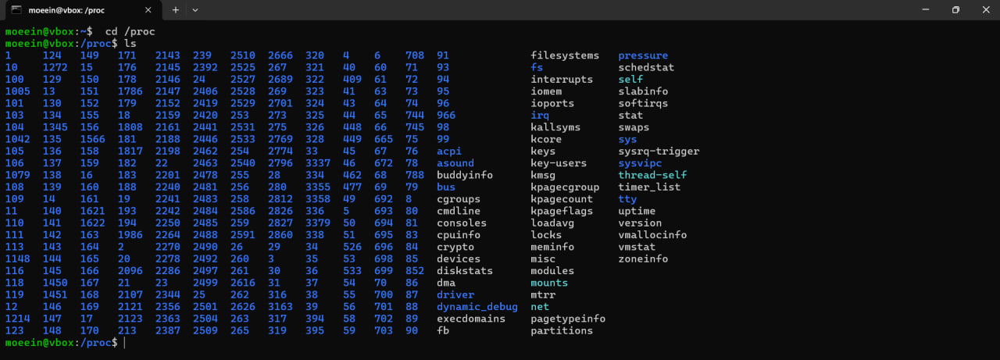
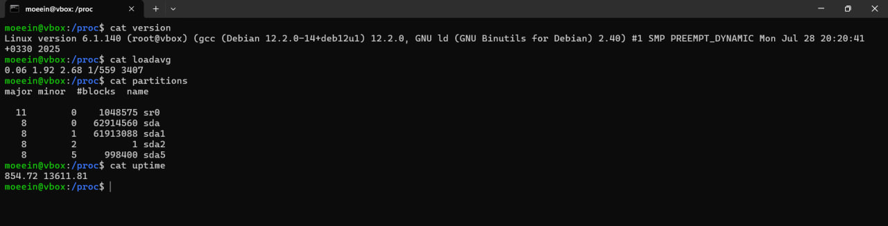

# آزمایش شماره ۳ - مشاهده رفتار هسته و سیستم‌عامل

## مشاهده فایل سیستم `proc/`

ابتدا با استفاده از دستور 
`cd /proc`
به دایرکتوری 
`proc/`
می‌رویم.
سپس دستور 
`ls`
را می‌زنیم و لیست فایل‌ها و پوشه‌های موجود در این دایرکتوری را مشاهده می‌کنیم:



## مشاهده محتویات یک فایل در شاخه `proc/`


```
cat version
cat loadavg
cat partitions
cat uptime
```
با زدن دستورهای فوق می‌توان اطلاعات زیر را مشاهده کرد:

- این فایل اطلاعات ورژنینگ مربوط به سیستم‌عامل را نشان می‌دهد.
- فایل `loadavg` میانگین بار سیستم را نشان می‌دهد.
- فایل `partitions` هم ساختار پارتیشن‌بندی سیستم را نشان می‌دهد.
- فایل `uptime` مدت زمان بالا آمدن سیستم را نشان می‌دهد. عدد دوم هم نشان دهنده مدت زمان idle بودن پردازنده است.



حال داخل فایل write.cpp یک کد با زبان cpp پیاده‌سازی می‌کنیم که با هر اجرا، محتویات فایل `proc/version/` را داخل یک فایل به نام `LinuxVersion.txt` در دایرکتوری فعلی می‌نویسد.

```cpp
#include <iostream>
#include <fstream>
#include <string>

int main() {
    std::fstream read_file("/proc/version", std::ios::in);
    if (!read_file.is_open()) {
        std::perror("error in opening /proc/version");
        return 1;
    }

    std::fstream write_file("LinuxVersion.txt", std::ios::out | std::ios::app);
    if (!write_file.is_open()) {
        std::perror("error in opening LinuxVersion.txt");
        return 1;
    }

    std::string line;
    while (std::getline(read_file, line)) {
        write_file << line << '\n';
    }

    read_file.close();
    write_file.close();

    return 0;
}
```

